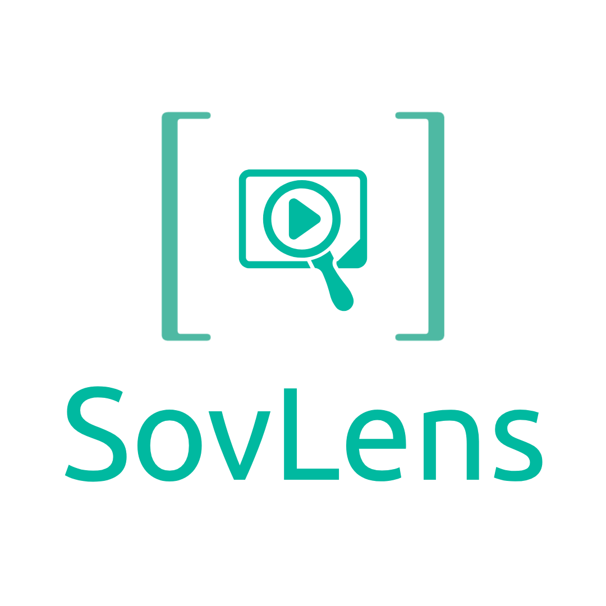

<div align="center">
  

  **Search your photos and videos like you search the web.**

  Private. Local. No cloud. No account.

  
  
  
</div>

---

## What is SovLens?

SovLens is a desktop app that builds a private, searchable index of your photo and video library. Drop a folder, and ask questions like:

- "sunset on the beach"
- "the dog jumping in the park"
- "iPhone on the table"
- "appointment 3 PM" — finds the screenshot of your calendar
- "the speech where she said inspire" — finds the moment in the video

Everything happens on your machine. Your files never leave it. No accounts, no telemetry.

## How it works

| Stage | What it does |
|-------|--------------|
| **Visual** | OpenAI CLIP turns each frame into a vector that captures meaning. Your text query becomes the same kind of vector. |
| **Voice** | Whisper transcribes audio tracks in videos locally. Spoken words become searchable. |
| **Text** | EasyOCR reads text in images and frames (signs, screenshots, receipts). |
| **Objects** *(Extreme level)* | YOLOv8 detects tiny objects (an iPhone in a vacation clip), each cropped and indexed separately for higher recall. |

Storage uses **LanceDB**, a fast on-disk vector database. Search is sub-100 ms for libraries up to ~50,000 frames; larger libraries auto-build an ANN index.

## Downloads

> SovLens is **unsigned** — macOS and Windows will show a security warning the first time. Instructions below.

Pre-built installers are on the [Releases page](https://github.com/asifwanders/SovLens/releases/latest):

| Platform | File | Size |
|----------|------|------|
| macOS (Apple Silicon) | `SovLens_x.y.z_aarch64.app.tar.gz` | ~80 MB |
| macOS (Intel) | `SovLens_x.y.z_x64.app.tar.gz` | ~80 MB |
| Windows 10/11 | `SovLens_x.y.z_x64-setup.exe` | ~80 MB |

The installer is small because AI models download on first use (~1.5 GB total, only what each level needs). The app shows a progress bar.

### First-run security warning

**macOS:** double-click the `.app.tar.gz` to extract, drag `SovLens.app` to your Applications folder. When you launch:
- *"SovLens can't be opened because Apple cannot check it for malicious software."*
- Right-click the app → **Open** → **Open**. One-time only.

If Gatekeeper says **"SovLens is damaged and can't be opened"** instead, browsers (Firefox, Chrome) tag the download with `com.apple.quarantine` which Gatekeeper refuses to skip via right-click. Strip it once in Terminal:
```bash
xattr -dr com.apple.quarantine /Applications/SovLens.app
```
Then double-click normally. This is a one-time fix per install.

**Windows:** double-click the `.exe`. SmartScreen says:
- *"Windows protected your PC."*
- Click **More info** → **Run anyway**.

These warnings appear because SovLens is not code-signed (the certificates cost hundreds per year). The source code is open and reproducible from this repo.

## Privacy

- All processing is local. The only outbound traffic is:
  - Model downloads on first use (HuggingFace, Ultralytics CDNs)
  - Auto-update check (GitHub Releases manifest)
- No telemetry. No analytics. No accounts.
- Crash logs are written **locally only** to your app data folder. Opt-in to share them via the in-app "Report Bug" button (creates a pre-filled GitHub issue you review before submitting).

## Hardware

| Platform | Acceleration |
|----------|--------------|
| macOS (Apple Silicon) | MPS (CLIP), VideoToolbox (video decode/transcode) |
| Windows + NVIDIA GPU | CUDA (CLIP, Whisper, YOLO), NVENC/NVDEC (video) |
| No GPU | CPU fallback — slower but functional |

Minimum: 8 GB RAM, 10 GB free disk. Recommended for High/Extreme analysis levels: 16 GB RAM, NVIDIA GPU.

## Analysis levels

Choose in **Settings**. Higher levels find more, take longer, use more disk.

| Level | Frame sampling | Audio | OCR | Object detection |
|-------|----------------|-------|-----|------------------|
| **Low** | every 10 s | off | off | off |
| **Medium** *(default)* | every 3 s | off | off | off |
| **High** | every 1.5 s | Whisper base | on | off |
| **Extreme** | every 0.5 s | Whisper small | on | YOLOv8 |

Changing levels affects new media only. Use **Settings → Re-Index All** to reprocess your library at the new level.

## Build from source

See [BUILDING.md](BUILDING.md).

Quick start (developer mode):

```bash
# Clone
git clone git@github.com:asifwanders/SovLens.git
cd SovLens

# Backend
cd backend
python3.11 -m venv venv
source venv/bin/activate
pip install -c constraints.txt -r requirements.txt
python main.py &   # FastAPI on :14793

# Frontend (in another terminal)
cd ../frontend
npm install
npm run tauri dev
```

Windows + CUDA: install CUDA torch *before* the main requirements:

```powershell
pip install torch --index-url https://download.pytorch.org/whl/cu121
pip install -c constraints.txt -r requirements.txt
```

## Contributing

See [CONTRIBUTING.md](CONTRIBUTING.md). Issues and pull requests welcome.

## License

GNU General Public License v3.0 — see [LICENSE](LICENSE).

In short: you can use, modify, and redistribute SovLens freely. If you distribute modified versions, you must also share them under GPL-3.0 with source available.

## Credits

Built by [SovStac](https://sovstac.com) with love in Pakistan 🇵🇰.

Stands on the shoulders of [OpenAI CLIP](https://github.com/openai/CLIP), [Whisper](https://github.com/openai/whisper), [EasyOCR](https://github.com/JaidedAI/EasyOCR), [YOLOv8](https://github.com/ultralytics/ultralytics), [LanceDB](https://github.com/lancedb/lancedb), [Tauri](https://tauri.app), and [Next.js](https://nextjs.org).
